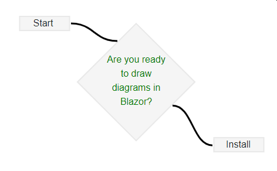

## Excubo.Blazor.Diagrams

[](https://www.nuget.org/packages/Excubo.Blazor.Diagrams/)
[](https://www.nuget.org/packages/Excubo.Blazor.Diagrams/)
[](https://github.com/excubo-ag/Blazor.Diagrams)

Excubo.Blazor.Diagrams is a native-Blazor diagram component library.



[Demo on github.io using Blazor Webassembly](https://excubo-ag.github.io/Blazor.Diagrams/)

## Key features

- Adding/Moving/Removing of nodes
- Moving/Removing groups of nodes (select multiple nodes by drawing a region (-> press `[shift]`), or by adding/removing individual nodes by clicking them while holding `[ctrl]`)
- Adding/Modifying/Removing links (including shape of curve for CurvedLink!)
- Undo/Redo with `[Ctrl]+[z]` (undo) and `[Ctrl]+[Shift]+[z]` / `[Ctrl]+[y]`(redo)
- Panning/Zooming
- Default link connection ports by position (North, NorthEast, East,...)
- Custom nodes/links
- Node library (fully customizable) for adding new nodes
- Change shape and arrows for links
- Overview screen for easy navigation on large diagrams
- Customizable background (grid lines, color, any style you want)

## How to use

Using Excubo.Blazor.Diagrams doesn't require any difficult installation. You need to install it and use it, that's it:

### 1. Install the nuget package Excubo.Blazor.Diagrams

Excubo.Blazor.Diagrams is distributed [via nuget.org](https://www.nuget.org/packages/Excubo.Blazor.Diagrams/).
[](https://www.nuget.org/packages/Excubo.Blazor.Diagrams/)

#### Package Manager:
```ps
Install-Package Excubo.Blazor.Diagrams
```

#### .NET Cli:
```cmd
dotnet add package Excubo.Blazor.Diagrams
```

#### Package Reference
```xml
<PackageReference Include="Excubo.Blazor.Diagrams" />
```

### 2. Add the `Diagram` component to your component

```html
@using Excubo.Blazor.Diagrams

<Diagram>
    <Nodes>
        <Node Id="abc" X="500" Y="500">
            Hello node @context.Id
        </Node>
        <Node Id="def" X="1000" Y="500">
            Hello node @context.Id
        </Node>
    </Nodes>
    <Links>
    </Links>
</Diagram>
```

This is of course only a minimalistic example.
For more examples, have a look at [the sample project](https://github.com/excubo-ag/Blazor.Diagrams/tree/main/TestProject_Components), which is the basis for the [demo application](https://excubo-ag.github.io/Blazor.Diagrams/).

:information:
Should you get a blank screen instead of the expected diagram, make sure that the diagram has a non-zero height.
The diagram takes 100% of the height of the parent DOM node.
To see whether this is the issue you're experiencing, try wrapping the diagram in a `div` with a fixed size,
e.g. `<div style="height: 1000px; width: 1000px;"><Diagram>...</Diagram></div>`.

## Design principles

- Extensibility

Users get a set of built-in node shapes and link types, but can expand this freely and with minimal amount of effort by adding their own shapes.

- Blazor API

The API should feel like you're using Blazor, not a javascript library.

- Minimal js, minimal css, lazy-loaded only when you use the component

The non-C# part of the code of the library should be as tiny as possible. We set ourselves a maximum amount of 10kB for combined js+css.
The current payload is less than 100 bytes, and only gets loaded dynamically when the component is actually used.

## How to design a custom node

A complete example of how to design a custom node is available [here](https://github.com/excubo-ag/Blazor.Diagrams/blob/main/TestProject_Components/Pages/UserDefinedNode.razor).

## Changelog

### 4.X.Y

Starting with version 4.0.0, only the net6.0 TFM is targeted. This is a change to simplify dependency management and we strongly encourage all users to upgrade to net6.0.

### 3.0.0 

When implementing custom nodes, one must now decide between a node that has a fixed size (i.e. has a parameter for both width and height) or one that determines its size by the size of the node's content.
To upgrade existing projects, replace `NodeBase` with `ContentSizedNodeBase`.

### 2.0.0 

Starting with 2.0.0, `EventCallback<T>`s have been replaced with `Action<T>`. In most situations, there should be nothing to change. If you previously used `await` in the callback method, you now have to move that into a separate method:

before:
```cs
private async Task Callback(T value)
{
    Value = value;
    await FooAsync();
    await BarAsync();
}
```

after:
```cs
private void Callback(T value)
{
    Value = value;
    RunFooAndBarAsync();
}
private async Task RunFooAndBarAsync()
{
    await FooAsync();
    await BarAsync();
}
```

### 1.11.0 

Starting with version 1.11.0, `NodeBase` now implements `IDisposable`. This means that any node implementation inheriting from `NodeBase` that previously implemented `IDisposable` now needs to override `void Dispose()`:

before:
```cs
@implements IDisposable
public void Dispose()
{
    Resource.Dispose();
}
```

after:

```cs
public override void Dispose()
{
    Resource.Dispose();
    base.Dispose();
}
```